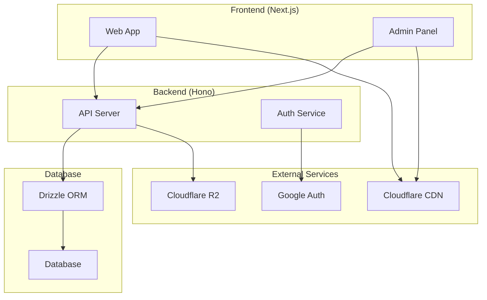
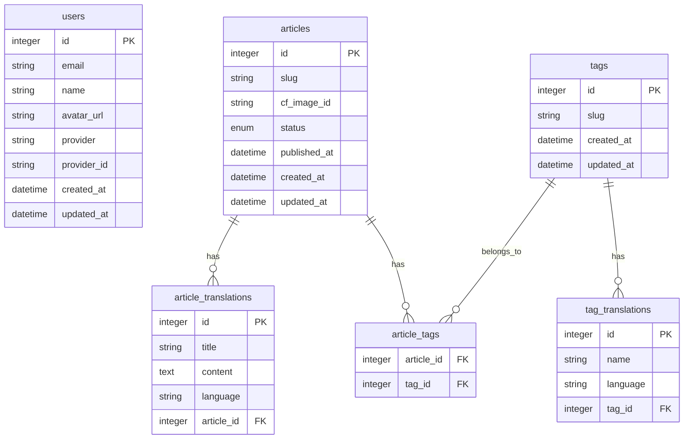
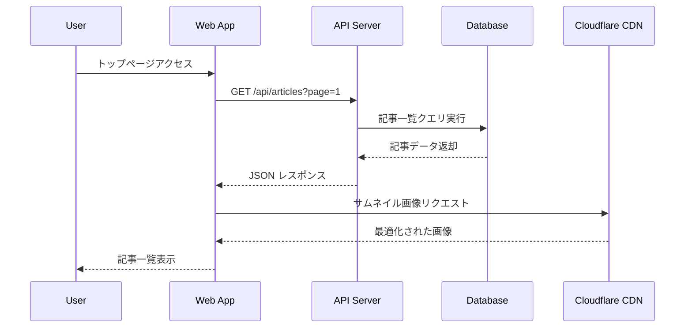
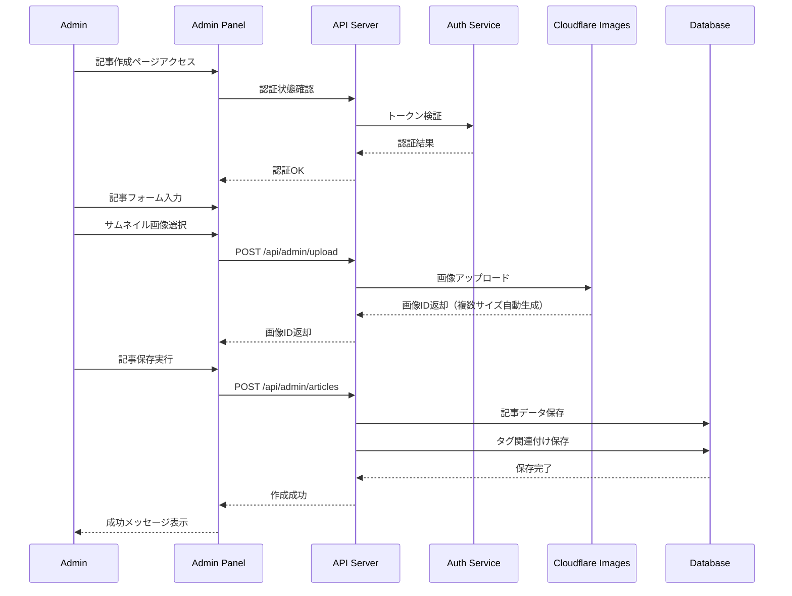
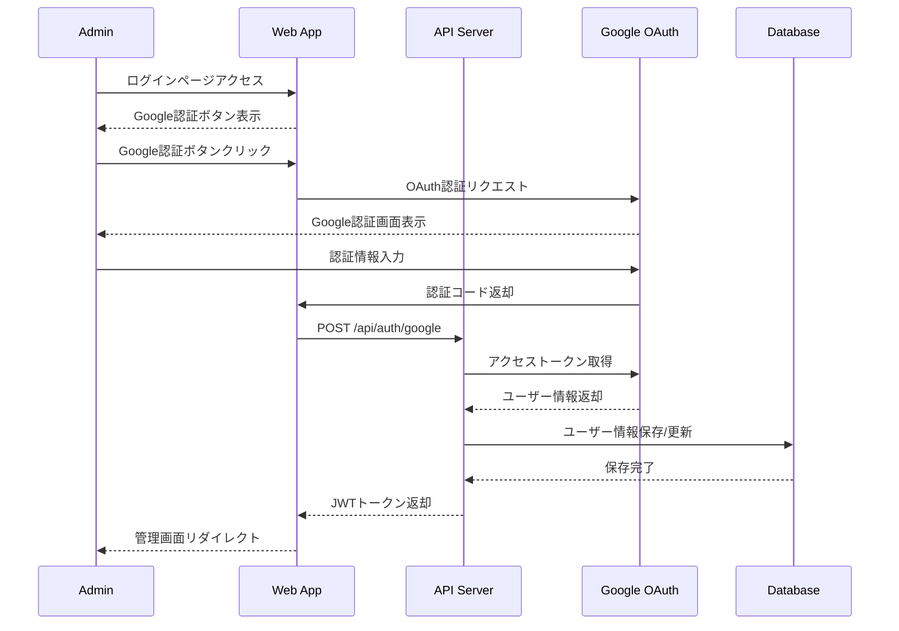
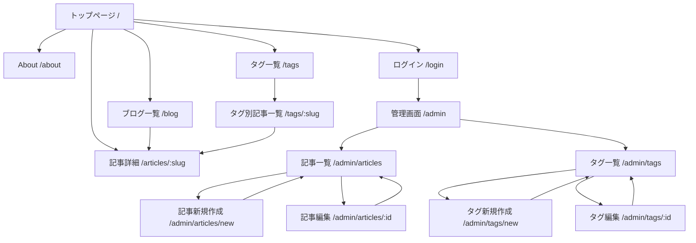

# 設計書

## 概要

Markdownブログシステムは、モノレポ構成でNext.js（フロントエンド）とHono（バックエンド）を使用したフルスタックWebアプリケーションです。Cloudflareインフラストラクチャを活用し、多言語対応とレスポンシブデザインを提供します。

## アーキテクチャ

### システム構成



### モノレポ構成

```
apps/
├── web/          # Next.js フロントエンド
├── backend/      # Hono API サーバー
packages/
├── db/           # Drizzle ORM設定
├── i18n/         # 国際化設定
```

## データモデル

### ERダイアグラム



### データモデル詳細

#### Users テーブル
- `id`: ユーザーID（integer, auto increment）
- `email`: メールアドレス（unique）
- `name`: 表示名
- `avatar_url`: アバター画像URL
- `provider`: 認証プロバイダー（google）
- `provider_id`: プロバイダー固有ID
- `created_at`: 作成日時
- `updated_at`: 更新日時

#### Articles テーブル
- `id`: 記事ID（integer, auto increment）
- `slug`: URL用スラッグ（unique）
- `cf_image_id`: Cloudflare Images ID
- `status`: ステータス（enum: published, draft, archived）
- `published_at`: 公開日時
- `created_at`: 作成日時
- `updated_at`: 更新日時

#### Article_Translations テーブル
- `id`: 翻訳ID（integer, auto increment）
- `title`: 記事タイトル
- `content`: Markdown形式の本文
- `language`: 言語（ja, en）
- `article_id`: 記事ID（articles.id）
- 制約: (title, language) の組み合わせでユニーク

#### Tags テーブル
- `id`: タグID（integer, auto increment）
- `slug`: URL用スラッグ（unique）
- `created_at`: 作成日時
- `updated_at`: 更新日時

#### Tag_Translations テーブル
- `id`: 翻訳ID（integer, auto increment）
- `name`: タグ名
- `language`: 言語（ja, en）
- `tag_id`: タグID（tags.id）
- 制約: (name, language) の組み合わせでユニーク

#### Article_Tags テーブル（中間テーブル）
- `article_id`: 記事ID（articles.id）
- `tag_id`: タグID（tags.id）
- 複合主キー: (article_id, tag_id)

## コンポーネントとインターフェース

### API エンドポイント設計

#### 公開API
- `GET /api/articles` - 記事一覧取得
- `GET /api/articles/:slug` - 記事詳細取得
- `GET /api/tags` - タグ一覧取得
- `GET /api/tags/:slug/articles` - タグ別記事一覧

#### 管理API（認証必須）
- `POST /api/auth/google` - Google認証
- `GET /api/admin/articles` - 管理用記事一覧
- `POST /api/admin/articles` - 記事作成
- `PUT /api/admin/articles/:id` - 記事更新
- `DELETE /api/admin/articles/:id` - 記事削除
- `GET /api/admin/tags` - 管理用タグ一覧
- `POST /api/admin/tags` - タグ作成
- `PUT /api/admin/tags/:id` - タグ更新
- `DELETE /api/admin/tags/:id` - タグ削除
- `POST /api/admin/upload` - 画像アップロード

## シーケンス図

### 記事閲覧フロー



### 記事作成フロー



### Google認証フロー



## エラーハンドリング

### エラーレスポンス形式

```typescript
interface ErrorResponse {
  error: {
    code: string;
    message: string;
    details?: any;
  };
  timestamp: string;
  path: string;
}
```

### エラーコード定義

- `AUTH_001`: 認証が必要
- `AUTH_002`: 認証トークンが無効
- `AUTH_003`: 権限が不足
- `VALIDATION_001`: バリデーションエラー
- `NOT_FOUND_001`: リソースが見つからない
- `UPLOAD_001`: ファイルアップロードエラー
- `DATABASE_001`: データベースエラー

## テスト戦略

### テストピラミッド

1. **単体テスト（Vitest）**
   - ユーティリティ関数
   - バリデーション関数
   - データ変換関数

2. **コンポーネントテスト（Storybook + Vitest）**
   - UIコンポーネント
   - フォームコンポーネント
   - レイアウトコンポーネント

3. **統合テスト（Vitest）**
   - API エンドポイント
   - データベース操作
   - 認証フロー

4. **E2Eテスト（Playwright）**
   - ユーザージャーニー
   - 管理者ワークフロー
   - 多言語切り替え

### テストデータ戦略

- テスト用データベースの使用
- ファクトリーパターンでテストデータ生成
- モックサービスの活用（画像アップロード等）

## セキュリティ考慮事項

### 認証・認可
- JWT トークンベース認証
- CSRF 保護
- CORS 設定

### データ保護
- 入力値サニタイゼーション
- SQLインジェクション対策（Drizzle ORM使用）
- XSS対策

### ファイルアップロード
- ファイルタイプ検証
- ファイルサイズ制限
- 安全なファイル名生成

## UI設計と画面遷移

### 画面遷移図



### ワイヤーフレーム

#### 1. トップページ（/）

```
┌─────────────────────────────────────────────────────────────┐
│ [Logo] [Blog] [About]     [🌙 Theme] [🌐 Locale] [Tags]     │
├─────────────────────────────────────────────────────────────┤
│                                                             │
│  ┌─────────────────────────────────────────────────────────┐ │
│  │ 最新記事                                                │ │
│  └─────────────────────────────────────────────────────────┘ │
│                                                             │
│  ┌──────────┐  ┌─────────────────────────────────────────┐   │
│  │[サムネイル]│  │ 記事タイトル                            │   │
│  │          │  │ 公開日: 2024-01-01                     │   │
│  │          │  │ タグ: [JavaScript] [React] [Next.js]   │   │
│  └──────────┘  │ 記事の概要テキスト...                   │   │
│                └─────────────────────────────────────────┘   │
│                                                             │
│  ┌──────────┐  ┌─────────────────────────────────────────┐   │
│  │[サムネイル]│  │ 記事タイトル2                           │   │
│  │          │  │ 公開日: 2024-01-02                     │   │
│  │          │  │ タグ: [TypeScript] [Node.js]           │   │
│  └──────────┘  │ 記事の概要テキスト...                   │   │
│                └─────────────────────────────────────────┘   │
│                                                             │
│              [← 前のページ] [1] [2] [3] [次のページ →]        │
└─────────────────────────────────────────────────────────────┘
```

#### 2. 記事詳細ページ（/articles/:slug）

```
┌─────────────────────────────────────────────────────────────┐
│ [Logo] [Blog] [About]     [🌙 Theme] [🌐 Locale] [Tags]     │
├─────────────────────────────────────────────────────────────┤
│                                                             │
│  ┌─────────────────────────────────────────────────────────┐ │
│  │                   [サムネイル画像]                        │ │
│  └─────────────────────────────────────────────────────────┘ │
│                                                             │
│  記事タイトル                                               │
│  公開日: 2024-01-01                                        │
│  タグ: [JavaScript] [React] [Next.js]                      │
│                                                             │
│  ┌─────────────────────────────────────────────────────────┐ │
│  │                                                         │ │
│  │  # 見出し1                                              │ │
│  │                                                         │ │
│  │  記事の本文がMarkdownで表示されます。                   │ │
│  │                                                         │ │
│  │  ## 見出し2                                             │ │
│  │                                                         │ │
│  │  - リスト項目1                                          │ │
│  │  - リスト項目2                                          │ │
│  │                                                         │ │
│  │  ```javascript                                          │ │
│  │  console.log('Hello World');                            │ │
│  │  ```                                                    │ │
│  │                                                         │ │
│  └─────────────────────────────────────────────────────────┘ │
│                                                             │
│  [← トップページに戻る]                                     │
└─────────────────────────────────────────────────────────────┘
```

#### 3. タグ一覧ページ（/tags）

```
┌─────────────────────────────────────────────────────────────┐
│ [Logo] [Blog] [About]     [🌙 Theme] [🌐 Locale] [Tags]     │
├─────────────────────────────────────────────────────────────┤
│                                                             │
│  ┌─────────────────────────────────────────────────────────┐ │
│  │ タグ一覧                                                │ │
│  └─────────────────────────────────────────────────────────┘ │
│                                                             │
│  ┌─────────────────────────────────────────────────────────┐ │
│  │ [JavaScript] (12記事)                                   │ │
│  │ [React] (8記事)                                         │ │
│  │ [Next.js] (6記事)                                       │ │
│  │ [TypeScript] (10記事)                                   │ │
│  │ [Node.js] (5記事)                                       │ │
│  │ [CSS] (7記事)                                           │ │
│  └─────────────────────────────────────────────────────────┘ │
│                                                             │
│  [← トップページに戻る]                                     │
└─────────────────────────────────────────────────────────────┘
```

#### 4. 管理画面 - 記事一覧（/admin/articles）

```
┌─────────────────────────────────────────────────────────────┐
│ 管理画面                                      [ログアウト]   │
├─────────────────────────────────────────────────────────────┤
│ [記事管理] [タグ管理]                                       │
├─────────────────────────────────────────────────────────────┤
│                                                             │
│  記事一覧                              [+ 新規記事作成]     │
│                                                             │
│  ┌─────────────────────────────────────────────────────────┐ │
│  │ サムネイル │ タイトル    │ タグ      │ ステータス │ 操作 │ │
│  ├─────────────────────────────────────────────────────────┤ │
│  │ [画像]     │ 記事1      │ JS, React │ 公開済み   │ 編集 │ │
│  │ [画像]     │ 記事2      │ TS        │ 下書き     │ 編集 │ │
│  │ [画像]     │ 記事3      │ CSS       │ アーカイブ │ 編集 │ │
│  └─────────────────────────────────────────────────────────┘ │
│                                                             │
│              [← 前のページ] [1] [2] [3] [次のページ →]        │
└─────────────────────────────────────────────────────────────┘
```

#### 5. 管理画面 - 記事作成/編集（/admin/articles/new）

```
┌─────────────────────────────────────────────────────────────┐
│ 管理画面                                      [ログアウト]   │
├─────────────────────────────────────────────────────────────┤
│ [記事管理] [タグ管理]                                       │
├─────────────────────────────────────────────────────────────┤
│                                                             │
│  記事作成                                                   │
│                                                             │
│  ┌─────────────────────────────────────────────────────────┐ │
│  │ サムネイル画像                                          │ │
│  │ [ファイル選択] [アップロード]                           │ │
│  │ ┌─────────────────────────────────────────────────────┐ │ │
│  │ │ [プレビュー画像]                                    │ │ │
│  │ └─────────────────────────────────────────────────────┘ │ │
│  └─────────────────────────────────────────────────────────┘ │
│                                                             │
│  ┌─────────────────────────────────────────────────────────┐ │
│  │ タイトル (日本語)                                       │ │
│  │ [                                                     ] │ │
│  └─────────────────────────────────────────────────────────┘ │
│                                                             │
│  ┌─────────────────────────────────────────────────────────┐ │
│  │ タイトル (English)                                      │ │
│  │ [                                                     ] │ │
│  └─────────────────────────────────────────────────────────┘ │
│                                                             │
│  ┌─────────────────────────────────────────────────────────┐ │
│  │ タグ                                                    │ │
│  │ [JavaScript ×] [React ×] [+ タグを追加]                 │ │
│  └─────────────────────────────────────────────────────────┘ │
│                                                             │
│  ┌─────────────────────────────────────────────────────────┐ │
│  │ 本文 (日本語) - Markdown                                │ │
│  │ ┌─────────────────────────────────────────────────────┐ │ │
│  │ │ # 見出し                                            │ │ │
│  │ │                                                     │ │ │
│  │ │ 本文をMarkdownで入力...                             │ │ │
│  │ │                                                     │ │ │
│  │ └─────────────────────────────────────────────────────┘ │ │
│  └─────────────────────────────────────────────────────────┘ │
│                                                             │
│  ┌─────────────────────────────────────────────────────────┐ │
│  │ 本文 (English) - Markdown                               │ │
│  │ ┌─────────────────────────────────────────────────────┐ │ │
│  │ │ # Heading                                           │ │ │
│  │ │                                                     │ │ │
│  │ │ Content in Markdown...                              │ │ │
│  │ │                                                     │ │ │
│  │ └─────────────────────────────────────────────────────┘ │ │
│  └─────────────────────────────────────────────────────────┘ │
│                                                             │
│  ステータス: [公開済み ▼] [下書き保存] [公開]               │
│                                                             │
│  [キャンセル] [プレビュー] [保存]                           │
└─────────────────────────────────────────────────────────────┘
```

### レスポンシブデザイン考慮事項

#### モバイル表示（768px以下）

- ヘッダーはハンバーガーメニューに変更
- 記事一覧は1カラム表示
- サムネイル画像は上部に配置
- 管理画面のテーブルはカード形式に変更
- タッチフレンドリーなボタンサイズ

#### タブレット表示（768px-1024px）

- 2カラムレイアウト
- サイドバーの表示/非表示切り替え
- 適度な余白とパディング

### UI コンポーネント設計

#### 共通コンポーネント
- Header（ナビゲーション、言語切り替え、テーマ切り替え）
- Footer
- Button（Primary, Secondary, Danger）
- Card（記事カード、タグカード）
- Modal（確認ダイアログ）
- Loading（スピナー、スケルトン）

#### フォームコンポーネント
- Input（テキスト、メール、パスワード）
- Textarea（Markdown エディタ）
- Select（ドロップダウン）
- FileUpload（画像アップロード）
- TagSelector（タグ選択）

#### 記事表示コンポーネント
- ArticleCard（記事一覧用）
- ArticleContent（Markdown レンダリング）
- TagList（タグ一覧表示）
- Pagination（ページネーション）

## パフォーマンス最適化

### フロントエンド
- Next.js の静的生成活用
- 画像最適化（next/image）
- コード分割
- キャッシュ戦略

### バックエンド
- データベースインデックス最適化
- クエリ最適化
- レスポンスキャッシュ

### インフラ
- Cloudflare CDN活用
- 画像配信最適化
- 地理的分散
