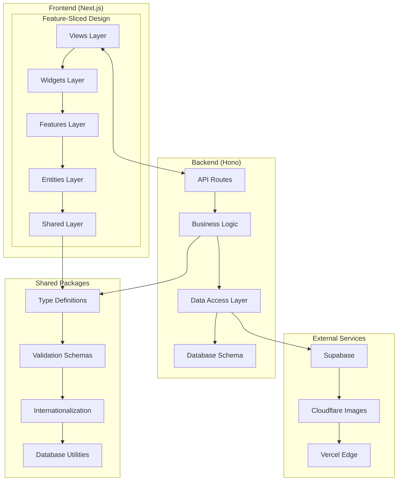
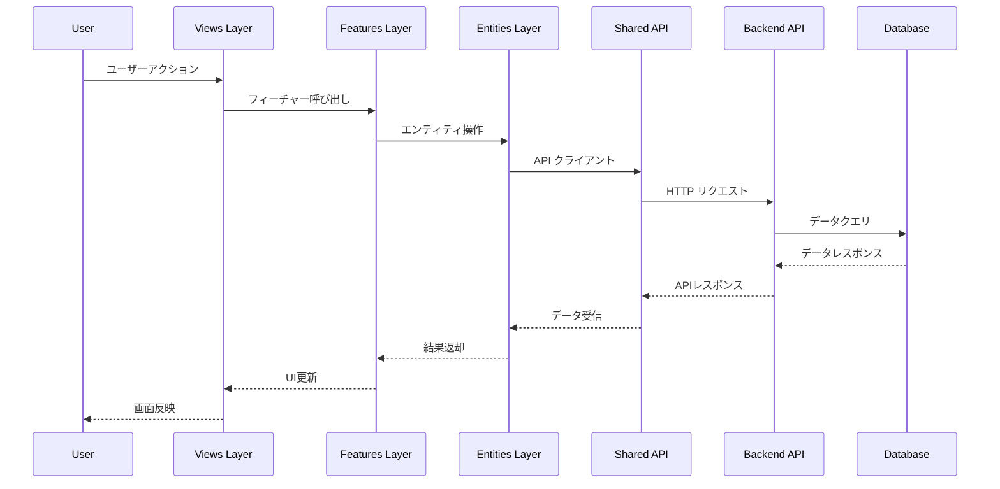
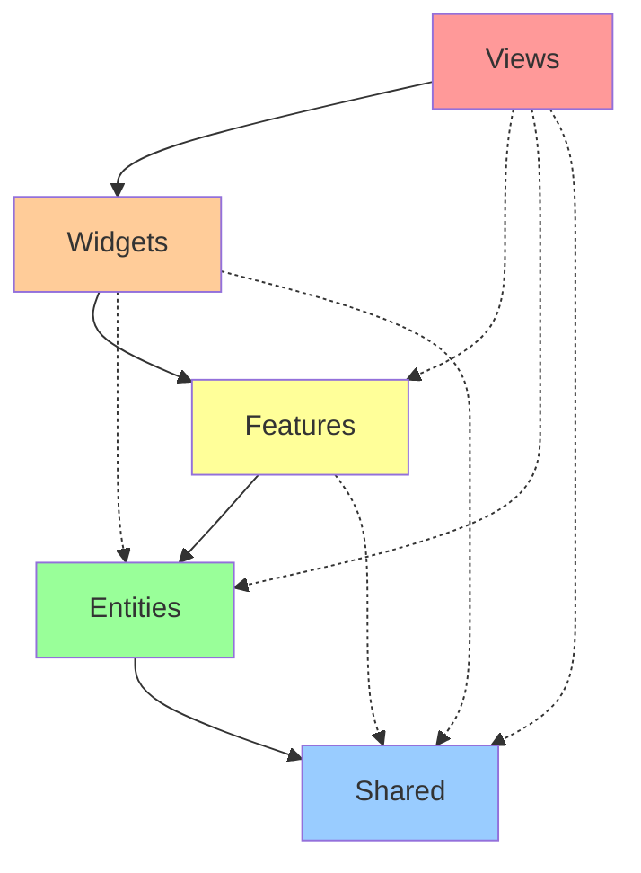

# Architecture Overview

saneatsu.me プロジェクトのアーキテクチャ全体像と設計思想について説明します。

## 🎯 アーキテクチャの設計原則

### **スケーラビリティ優先**
- 機能追加時の影響範囲を最小化
- モジュール間の依存関係を明確化
- 並行開発に適した構造

### **保守性の重視**
- 責任の明確な分離
- 予測可能なコード配置
- 一貫した命名規約

### **型安全性の確保**
- エンドツーエンドの型安全性
- ランタイムエラーの最小化
- 開発時の早期エラー検出

## 🏗️ 全体アーキテクチャ図



## 📁 プロジェクト構造

### **Monorepo構成**
```
saneatsu.me/
├── apps/
│   ├── web/                 # フロントエンドアプリケーション
│   ├── backend/             # バックエンドAPIサーバー
│   └── docs/                # ドキュメントサイト
├── packages/
│   ├── db/                  # データベース関連
│   ├── i18n/                # 国際化リソース
│   └── schemas/             # 共通型定義・バリデーション
└── tools/
    ├── biome.json           # Linter/Formatter設定
    ├── turbo.json           # Monorepo管理設定
    └── lefthook.yml         # Git Hooks設定
```

### **Frontend構造（Feature-Sliced Design）**
```
apps/web/src/
├── app/                     # Next.js App Router
│   ├── [locale]/
│   │   ├── layout.tsx
│   │   ├── page.tsx
│   │   └── articles/
│   └── api/                 # API Routes（プロキシ）
├── views/                   # Views Layer
│   ├── home/
│   ├── article-detail/
│   └── articles-list/
├── widgets/                 # Widgets Layer
│   ├── header/
│   ├── footer/
│   └── articles-list/
├── features/                # Features Layer
│   ├── article/
│   ├── auth/
│   └── lang/
├── entities/                # Entities Layer
│   ├── article/
│   ├── tag/
│   └── user/
└── shared/                  # Shared Layer
    ├── api/
    ├── ui/
    ├── lib/
    └── config/
```

### **Backend構造**
```
apps/backend/src/
├── routes/                  # API エンドポイント
│   ├── articles/
│   │   ├── index.ts
│   │   └── schema.ts
│   └── tags/
│       ├── index.ts
│       └── schema.ts
├── middleware/              # 共通ミドルウェア
├── utils/                   # ユーティリティ
└── index.ts                 # アプリケーションエントリーポイント
```

## 🔄 データフロー

### **Frontend → Backend**


### **型の流れ**
```typescript
// 1. データベーススキーマ（Drizzle）
export const articles = sqliteTable('articles', {
  id: integer('id').primaryKey(),
  title: text('title').notNull(),
  // ...
})

// 2. 型推論
export type Article = typeof articles.$inferSelect

// 3. APIスキーマ（Zod）
export const ArticleSchema = z.object({
  id: z.number(),
  title: z.string(),
  // ...
})

// 4. フロントエンド型定義
export interface Article {
  id: number
  title: string
  // ...
}

// 5. コンポーネントProps
interface ArticleCardProps {
  article: Article
}
```

## 🧩 レイヤー間の依存関係

### **Feature-Sliced Design の依存ルール**



#### **許可される依存関係**
- ✅ 上位レイヤーから下位レイヤーへの依存
- ✅ 同一レイヤー内のスライス間の依存（制限付き）
- ❌ 下位レイヤーから上位レイヤーへの依存
- ❌ Entities レイヤーからのFeatures レイヤーへの依存

#### **実装例**
```typescript
// ✅ 正しい依存関係
// views/home → widgets/articles-list
import { ArticlesList } from '../../widgets/articles-list'

// views/home → features/article
import { ArticleSearch } from '../../features/article'

// features/article → entities/article
import { Article } from '../../entities/article'

// ❌ 間違った依存関係
// entities/article → features/article (下位→上位)
// shared → features (下位→上位)
```

## 🎨 UIアーキテクチャパターン

### **コンポーネント設計原則**

#### **単一責任原則**
```typescript
// ❌ 複数の責任を持つコンポーネント
function ArticlePageComponent() {
  // データフェッチ + UI表示 + ビジネスロジック
}

// ✅ 責任を分離したコンポーネント
function ArticleDetailView({ article }: { article: Article }) {
  // UI表示のみに責任を限定
}

function useArticle(slug: string) {
  // データフェッチロジック
}
```

#### **Props型の明確化**
```typescript
// ✅ 明確なProps型定義
interface ArticleCardProps {
  article: Article
  locale: Locale
  onTagClick?: (tag: Tag) => void
  className?: string
}

export function ArticleCard({ 
  article, 
  locale, 
  onTagClick,
  className 
}: ArticleCardProps) {
  // ...
}
```

#### **コンポーネント合成**
```typescript
// ✅ 合成可能なコンポーネント設計
export function ArticleCard({ article, children }: PropsWithChildren<ArticleCardProps>) {
  return (
    <article className="border rounded-lg p-6">
      <ArticleCard.Header article={article} />
      <ArticleCard.Content>{children}</ArticleCard.Content>
      <ArticleCard.Footer article={article} />
    </article>
  )
}

ArticleCard.Header = function ArticleHeader({ article }) { /* ... */ }
ArticleCard.Content = function ArticleContent({ children }) { /* ... */ }
ArticleCard.Footer = function ArticleFooter({ article }) { /* ... */ }
```

## 🔒 セキュリティアーキテクチャ

### **多層防御戦略**

#### **入力検証（Frontend）**
```typescript
// クライアントサイドバリデーション
const formSchema = z.object({
  title: z.string().min(1).max(200),
  content: z.string().min(1),
})

function ArticleForm() {
  const form = useForm({
    resolver: zodResolver(formSchema),
  })
  // ...
}
```

#### **API層での検証（Backend）**
```typescript
// サーバーサイドバリデーション
app.post('/articles', 
  zValidator('json', CreateArticleSchema),
  async (c) => {
    const validData = c.req.valid('json') // 型安全
    // ...
  }
)
```

#### **データベース層での制約**
```sql
-- データベースレベルの制約
CREATE TABLE articles (
  id INTEGER PRIMARY KEY,
  title TEXT NOT NULL CHECK(length(title) > 0),
  slug TEXT NOT NULL UNIQUE,
  -- ...
);
```

## 📊 パフォーマンス設計

### **最適化ポイント**

#### **フロントエンド最適化**
- **Code Splitting**: ルートベースの動的インポート
- **Image Optimization**: Next.js Image による自動最適化
- **Caching**: React Query によるデータキャッシュ

#### **バックエンド最適化**
- **Database Indexing**: 頻繁なクエリのインデックス
- **Connection Pooling**: データベース接続の効率化
- **Response Caching**: CDN レベルでのキャッシュ

#### **インフラ最適化**
- **Edge Computing**: Vercel Edge Functions
- **CDN**: グローバル配信ネットワーク
- **Asset Optimization**: 自動的な画像・CSS最適化

## 🧪 テスタビリティ設計

### **テスト可能なアーキテクチャ**

#### **依存性注入**
```typescript
// テスト可能な設計
export function createArticleService(apiClient: ApiClient) {
  return {
    async getArticles(params: GetArticlesParams) {
      return apiClient.get('/articles', { params })
    }
  }
}

// テスト時はモックを注入
const mockApiClient = createMockApiClient()
const articleService = createArticleService(mockApiClient)
```

#### **純粋関数の活用**
```typescript
// 副作用のない純粋関数
export function formatArticleDate(
  publishedAt: string, 
  locale: Locale
): string {
  return new Date(publishedAt).toLocaleDateString(locale)
}

// テストが容易
expect(formatArticleDate('2024-01-01', 'ja')).toBe('2024/1/1')
```

---

次のセクション: **[Feature-Sliced Design](./feature-sliced-design)** で FSD の詳細実装をご覧ください。