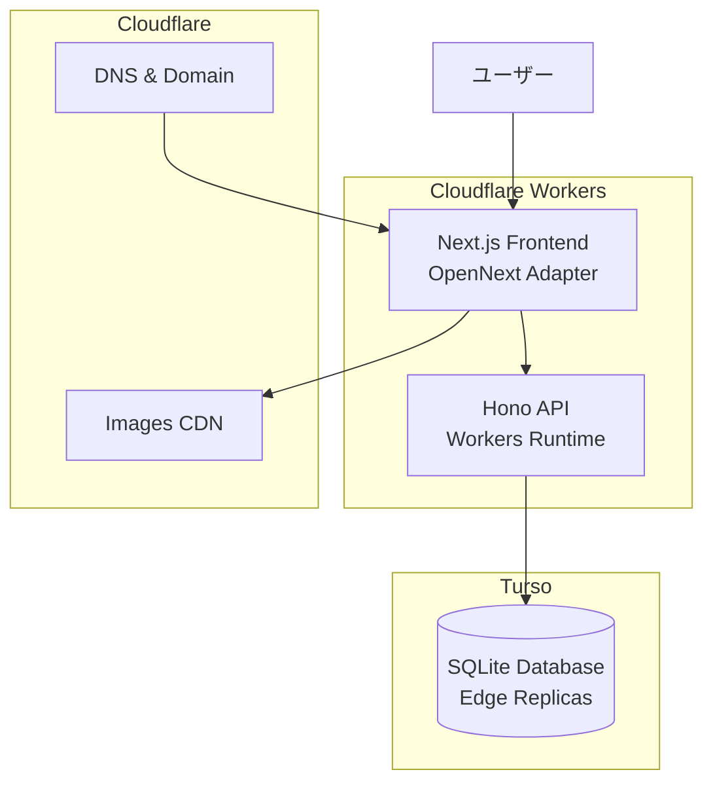

# デプロイとインフラ構成

saneatsu.meプロジェクトのデプロイメントとインフラストラクチャの概要です。

## インフラアーキテクチャ

### Cloudflare Workers



## 使用サービス

### Cloudflare Workers

- **用途**: フロントエンドとAPIのホスティング
- **機能**:
  - エッジでの高速実行
  - 自動スケーリング
  - ゼロコールドスタート
  - グローバルなエッジネットワーク
  - 自動デプロイ（GitHub Actions + wrangler）

### Turso

- **用途**: データベース（SQLite）
- **機能**:
  - エッジレプリケーション
  - 自動バックアップ
  - 低レイテンシアクセス

### Cloudflare Images

- **用途**: 画像の最適化と配信
- **機能**:
  - 自動画像最適化
  - レスポンシブ画像生成
  - グローバルCDN配信

## デプロイフロー

### 1. 開発環境

```bash
# ローカル開発
pnpm dev

# ビルドの確認
pnpm build

# 本番環境の動作確認
pnpm start
```

### 2. プレビューデプロイ

プルリクエストを作成すると、GitHub Actionsで自動的にプレビュー環境がデプロイされます：

1. PRを作成
2. GitHub Actionsがビルドを実行
3. Cloudflare Workersにデプロイ
4. プレビューURLで動作確認

### 3. 本番デプロイ

mainブランチへのマージで自動デプロイ：


## 環境変数の管理

環境変数は用途に応じて3つのカテゴリに分けて管理されています：

- **ビルド時環境変数**（GitHub Secrets）
- **実行時環境変数**（Cloudflare Worker Secrets）
- **公開設定値**（wrangler.toml）

詳細な設定方法については、[環境変数管理ドキュメント](./environment-variables.md)を参照してください。

### クイックスタート

開発環境では `.env` ファイルで管理：

```bash
# apps/web/.env
NEXT_PUBLIC_API_URL=http://localhost:3333
NEXTAUTH_URL=http://localhost:3210
# その他の環境変数...

# apps/backend/.env
TURSO_DATABASE_URL=...
TURSO_AUTH_TOKEN=...
CORS_ORIGIN=http://localhost:3210
```

## Cloudflare Workersの設定

### wrangler.toml

プロジェクトのデプロイ設定は `apps/web/wrangler.toml` で管理されています：

```toml
name = "saneatsu-me-web"
main = ".open-next/worker.js"
compatibility_date = "2024-01-01"

# 環境別の設定
[env.dev]
# 開発環境の設定

[env.preview]
# プレビュー環境の設定

[env.production]
# 本番環境の設定
```

### デプロイコマンド

```bash
# 開発環境
pnpm build:cloudflare && wrangler deploy --env dev

# プレビュー環境
pnpm build:cloudflare && wrangler deploy --env preview

# 本番環境
pnpm build:cloudflare && wrangler deploy --env production
```

## データベースマイグレーション

### 開発環境

```bash
# スキーマの変更を適用
pnpm db:push

# マイグレーションファイルを生成
pnpm db:generate

# マイグレーションを実行
pnpm db:migrate
```

### 本番環境

デプロイ前にマイグレーションを実行：

```bash
# CI/CDパイプラインで実行
pnpm db:migrate:deploy
```

## モニタリングとログ

### ログ管理

```typescript
// 構造化ログの実装
import { logger } from '@/lib/logger';

logger.info('User logged in', { 
  userId: user.id,
  timestamp: new Date()
});

logger.error('Payment failed', {
  error: error.message,
  userId: user.id,
  amount: payment.amount
});
```

## セキュリティ設定

### 環境変数の管理

- GitHub Secretsで安全に管理
- Cloudflare Worker Secretsで実行時に利用
- クライアントサイドには`NEXT_PUBLIC_`プレフィックスのみ公開

### CORS設定

```typescript
// apps/backend/src/index.ts
app.use(cors({
  origin: process.env.CORS_ORIGIN || 'http://localhost:3000',
  credentials: true
}));
```

### セキュリティヘッダー

```typescript
// next.config.js
module.exports = {
  async headers() {
    return [
      {
        source: '/:path*',
        headers: [
          {
            key: 'X-Frame-Options',
            value: 'DENY'
          },
          {
            key: 'X-Content-Type-Options',
            value: 'nosniff'
          },
          {
            key: 'X-XSS-Protection',
            value: '1; mode=block'
          }
        ]
      }
    ];
  }
};
```

## パフォーマンス最適化

### エッジファンクション

```typescript
// APIルートをエッジで実行
export const runtime = 'edge';

export async function GET(request: Request) {
  // エッジで実行される処理
}
```

### 画像最適化

```typescript
import Image from 'next/image';

// Cloudflare Imagesと連携した最適化
<Image
  src={`https://imagedelivery.net/${cfImageId}`}
  width={800}
  height={600}
  alt="記事画像"
  loading="lazy"
/>
```

### キャッシュ戦略

```typescript
// APIレスポンスのキャッシュ
export async function GET() {
  const data = await fetchData();
  
  return new Response(JSON.stringify(data), {
    headers: {
      'Cache-Control': 's-maxage=60, stale-while-revalidate',
    },
  });
}
```

## トラブルシューティング

### デプロイエラー

1. **ビルドエラー**
   ```bash
   # ローカルでビルドを確認
   pnpm build
   ```

2. **環境変数の不足**
   - GitHub Secretsで環境変数を確認
   - Cloudflare Worker Secretsで実行時環境変数を確認
   - 必要な変数がすべて設定されているか確認

3. **型エラー**
   ```bash
   # 型チェックを実行
   pnpm type-check
   ```

### パフォーマンス問題

1. **Cloudflare Workersの実行時間制限**
   - 処理を最適化
   - 重い処理は非同期化を検討

2. **データベース接続エラー**
   - Tursoの接続制限を確認
   - コネクションプールの設定を調整

## コスト最適化

### Cloudflare Workers

- **Free Plan**: 月100,000リクエストまで無料
- **Paid Plan**: 従量課金制（$5/月〜）

### Turso

- **Free Tier**: 8GB、3データベース
- **Pro Plan**: 必要に応じてスケール

### 最適化のヒント

1. 静的生成を活用
2. 画像の最適化
3. 不要なAPIコールの削減
4. キャッシュの活用