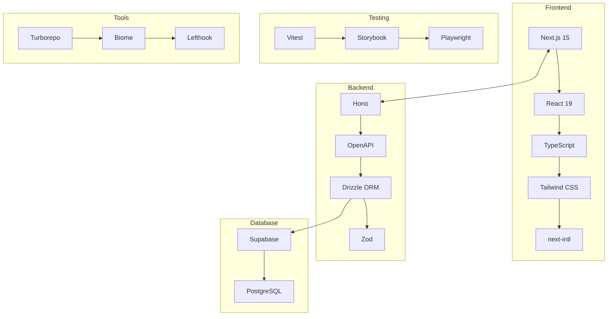

# Tech Stack Overview

saneatsu.me プロジェクトで使用している技術スタックの全体概要をご紹介します。

## 🎯 技術選定の方針

このプロジェクトでは以下の方針で技術を選定しています：

- **Type Safety First**: 全てのレイヤーで型安全性を最優先
- **Developer Experience**: 開発効率と保守性の向上
- **Performance**: ユーザー体験を重視したパフォーマンス最適化
- **Scalability**: 将来的な機能拡張に対応できる柔軟性
- **Modern Best Practices**: 業界標準のベストプラクティスの採用

## 📊 技術スタック全体図

## 🚀 主要技術一覧

### **Frontend Stack**

| 技術 | バージョン | 役割 | 選定理由 |
|------|-----------|------|----------|
| **Next.js** | 15.x | フロントエンドフレームワーク | React Server Components、App Router |
| **React** | 19.x | UIライブラリ | 最新の並行機能、Suspense |
| **TypeScript** | 5.8.x | 型システム | 型安全性、開発効率向上 |
| **Tailwind CSS** | 4.x | CSSフレームワーク | ユーティリティファースト、高い生産性 |
| **next-intl** | 3.x | 国際化 | App Router対応、型安全な翻訳 |

### **Backend Stack**

| 技術 | バージョン | 役割 | 選定理由 |
|------|-----------|------|----------|
| **Hono** | 4.x | APIフレームワーク | 高速、軽量、TypeScript ファースト |
| **OpenAPI** | 3.x | API仕様 | 自動ドキュメント生成、型安全性 |
| **Drizzle ORM** | 0.44.x | ORM | 型安全、高性能、軽量 |
| **Zod** | 4.x | バリデーション | 型安全なスキーマ定義 |

### **Database & Infrastructure**

| 技術 | 役割 | 選定理由 |
|------|------|----------|
| **Supabase** | BaaS | PostgreSQL、認証、リアルタイム機能 |
| **PostgreSQL** | データベース | 高機能、JSON対応、拡張性 |
| **Vercel** | ホスティング | Next.js最適化、エッジ配信 |

### **Development Tools**

| 技術 | バージョン | 役割 | 選定理由 |
|------|-----------|------|----------|
| **Turborepo** | 2.x | モノレポ管理 | 高速ビルド、効率的なキャッシュ |
| **Biome** | 2.x | Linter/Formatter | 高速、ESLint + Prettier代替 |
| **Lefthook** | 1.x | Git hooks | 軽量、高速なコミット品質チェック |
| **pnpm** | 9.x | パッケージマネージャー | 高速、効率的なディスク使用量 |

### **Testing Stack**

| 技術 | バージョン | 役割 | 選定理由 |
|------|-----------|------|----------|
| **Vitest** | 3.x | 単体・結合テスト | 高速、Vite統合、TypeScript対応 |
| **Storybook** | 9.x | コンポーネントテスト | UI開発、ドキュメント生成 |
| **Playwright** | 1.x | E2Eテスト | 高速、安定、クロスブラウザ対応 |
| **Testing Library** | 16.x | テストユーティリティ | ユーザー中心のテスト |

## 🔗 技術間の連携

### **フロントエンド ↔ バックエンド**
- **型共有**: Zodスキーマによる型安全なAPI通信
- **OpenAPI**: 自動生成されたAPI仕様によるフロントエンド統合
- **エラーハンドリング**: 統一されたエラーレスポンス形式

### **開発・テスト環境**
- **型安全性**: TypeScript → Zod → Drizzle の一貫した型システム
- **コード品質**: Biome + Lefthook による自動品質チェック
- **テスト戦略**: Unit → Component → E2E の段階的テスト

### **モノレポ管理**
- **パッケージ分離**: 関心事別のパッケージ管理
- **共有ライブラリ**: 型定義、ユーティリティの共通化
- **効率的ビルド**: Turborepoによる依存関係を考慮したビルド

## 📈 パフォーマンス特性

### **フロントエンド**
- **初期ロード**: Server Components による高速な初期表示
- **ルーティング**: App Router による効率的なページ遷移
- **画像最適化**: Next.js Image による自動最適化

### **バックエンド**
- **API レスポンス**: Hono による高速レスポンス（~3倍 vs Express）
- **データベース**: Connection pooling、効率的なクエリ
- **キャッシュ**: Vercel Edge Functions でのエッジキャッシュ

### **開発効率**
- **型安全性**: コンパイル時エラー検出による品質向上
- **Hot Reload**: Vite による高速な開発サーバー
- **ビルド時間**: Turborepo による並列ビルド最適化

## 🎖️ 技術的優位性

### **1. 統一された型システム**
- フロントエンドからデータベースまで一貫したTypeScript
- Zodによるランタイム型検証
- 型安全なAPI通信

### **2. 最新のReactエコシステム**
- React Server Components の活用
- 並行レンダリングによるUX向上
- Suspenseを活用した読み込み体験

### **3. 高性能なバックエンド**
- Honoによる軽量・高速API
- Drizzle ORMによる効率的なDB操作
- OpenAPIによる自動ドキュメント

### **4. 包括的な品質保証**
- 多層テスト戦略
- 自動化されたコード品質チェック
- 本番環境に近いテスト環境

## 📚 詳細ドキュメント

各技術の詳細な使用方法と設定については、以下のページをご覧ください：

- **[Frontend Technologies](./frontend)** - Next.js、React、UI技術の詳細
- **[Backend Technologies](./backend)** - Hono、Drizzle、API設計の詳細
- **Database & Infrastructure** - Supabase、PostgreSQLの設定と使用方法（準備中）
- **Testing Technologies** - テスト戦略と各ツールの使用方法（準備中）