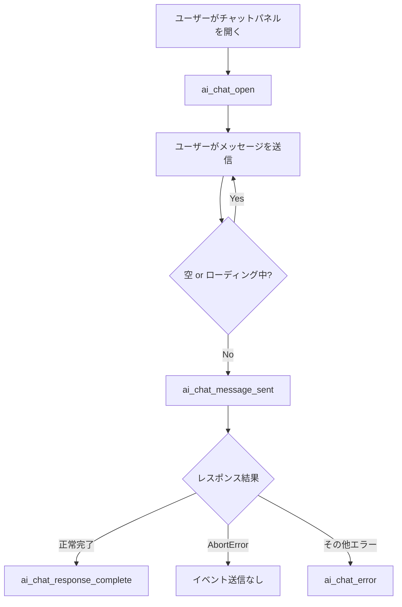

# Google Analytics 4 イベントトラッキング仕様

## 共通仕様

### 環境変数による制御

環境変数 `NEXT_PUBLIC_GA_ID` に GA4 測定ID（`G-XXXXXXXXXX`）を設定することでトラッキングが有効になる。
未設定の場合、スクリプトの読み込み・イベント送信は一切行われない。

### イベント送信関数

すべてのカスタムイベントは `trackEvent`（`shared/lib/analytics/track-event.ts`）経由で送信される。

```ts
trackEvent(eventName: string, params?: Record<string, string | number>): void
```

以下のいずれかに該当する場合、イベントは送信されない:

1. `NEXT_PUBLIC_GA_ID` が未設定
2. SSR 実行時（`typeof window === "undefined"`）
3. `window.gtag` が未読み込み（`typeof window.gtag === "undefined"`）

### 共通パラメータ: article_slug

AIチャット系イベント全てに含まれるパラメータ。

- **型**: `string`
- **値**: 閲覧中の記事の slug（例: `"my-first-post"`）
- **記事ページ外から開いた場合**: `"(none)"`

---

## AIチャットイベント

各イベントは `features/article-chat/lib/track-article-chat-event.ts` のヘルパー関数を通じて送信される。

### ai_chat_open

パネルコンポーネント（`ArticleChatPanel`）のマウント時に1回だけ送信される。

| パラメータ | 型 | 説明 |
|---|---|---|
| `article_slug` | `string` | 閲覧中の記事slug、または `"(none)"` |

### ai_chat_message_sent

ユーザーがメッセージを送信した時に送信される。空メッセージやローディング中の送信はガードされている。

| パラメータ | 型 | 説明 |
|---|---|---|
| `article_slug` | `string` | 閲覧中の記事slug、または `"(none)"` |
| `message_length` | `number` | トリム後のメッセージ文字数 |

**プライバシー配慮**: メッセージ内容自体は送信せず、文字数のみを記録する。

### ai_chat_response_complete

AIレスポンスのストリーミングが正常に完了した時に送信される。

| パラメータ | 型 | 説明 |
|---|---|---|
| `article_slug` | `string` | 閲覧中の記事slug、または `"(none)"` |
| `response_length` | `number` | レスポンス全体の文字数 |

### ai_chat_error

エラー発生時に送信される。ユーザーによるリクエストキャンセル（`AbortError`）は除外される。

| パラメータ | 型 | 説明 |
|---|---|---|
| `article_slug` | `string` | 閲覧中の記事slug、または `"(none)"` |
| `error_type` | `string` | `Error.message` の値、またはリテラル `"unknown"` |

---

## イベント送信フロー


